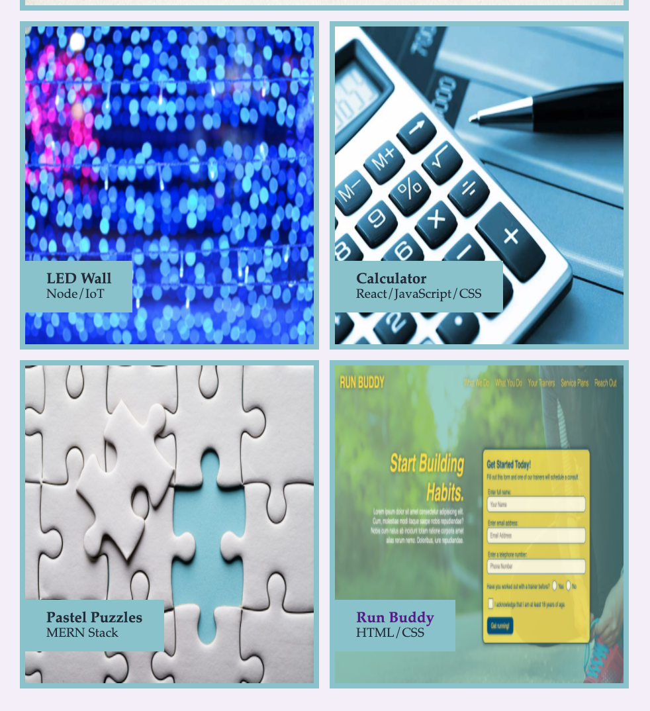

# Portfolio

This is a portfolio based on a mockup design, using CSS Grid. The portfolio is designed with web developers in mind, so they can use the grid layout in the "Work" section to showcase their work. 

## Description

This project started with this mockup design: 

I used CSS Grid for the page starting below the header and hero sections, so that the sections would have nice unanmimous edges to them.  I also used CSS Grid for the work section.  

The most challenging part is getting the work section to adapt to mobile devices, and I still haven't completely fixed this issue yet.  I changed the grid layout for mobile, which helped, but the images are still squished. See?

 

I tried adding max-height, flex display, etc.  Nothing worked.  If anyone has suggestions, I'm all ears!

Here is a preview of my finished project: 

And, you may view the page here: https://suzannaakins.github.io/portfolio/

Thank you for reading :blush: